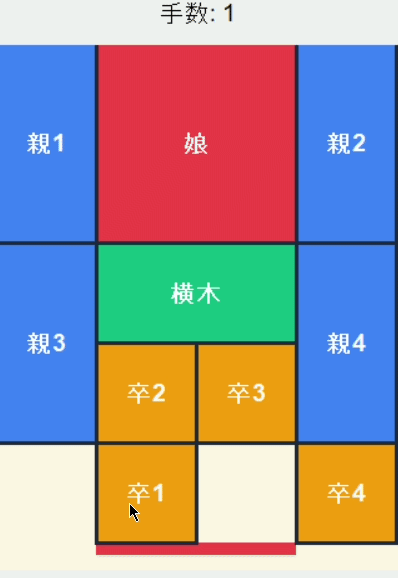

# 箱入り娘 (Hakoiri Musume) - Slide Puzzle
Pythonとtkinterで制作した、日本の伝統的なスライドパズル「箱入り娘」です。

## 🎥 動作デモ

※駒をドラッグ＆ドロップして動かし、赤い「娘」を下の出口から脱出させます。

## 🧠 技術的なポイント：スライド移動と衝突判定
単なる1マス移動ではなく、マウス操作に合わせた「連続移動」と「動的衝突判定」を実装しました。

### 工夫した実装内容
- **パス・クリア判定**: 駒を動かす際、現在地から目的地までの経路に他の駒がないかを1マスずつ走査して判定。これにより、直感的でスムーズな操作感を実現しました。
- **スナップ機能**: ドラッグ終了時に、最も近いグリッドに自動的に吸着（Snap-to-grid）させる計算式を実装。
- **効率的なデータ構造**: 各駒のサイズと位置を辞書型（dictionary）で管理し、軽量な当たり判定ロジックを構築しました。

## 🛠 使用技術
- **Language:** Python 3.11
- **Library:** tkinter
- **Logic:** 座標計算, 衝突判定アルゴリズム

## 📂 ファイル構成
- `hakoiri.py`: メインプログラム
- `hakoiri.gif`: 動作デモ画像

## 🎮 実行方法
1. 本リポジトリをクローンします。
2. 以下のコマンドで実行してください。
   `python hakoiri.py`
   
🤖 To maximize development efficiency, this project fully utilized AI tools for code generation. On the other hand, I independently managed the vast majority of the development lifecycle—ranging from requirements definition, screen transitions, and feature design, to crafting precise prompts, integrating the generated code, and handling final debugging and quality assurance.

（本プロジェクトでは、開発効率を最大化するため、コードの自動生成にAIを全面的に活用しています。 一方で、要件定義、画面遷移や機能の設計、AIへの正確なプロンプト構築、出力されたコードの統合、および最終的なデバッグや動作検証に至るまで、開発プロセスの大半は自身が主体となって一貫して行いました。）
